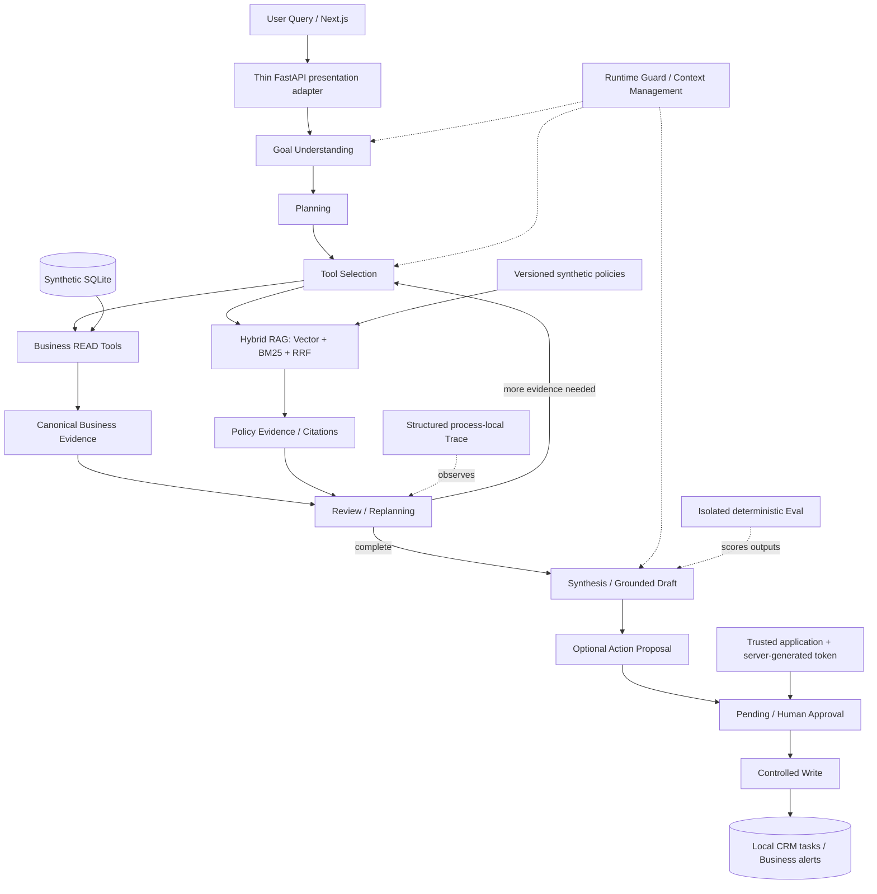

# Enterprise SalesOps Agent

**企业销售经营分析与行动智能体。** 从业务问题出发，查询结构化销售数据、检索制度、形成有据可查的结论，并提出需要人工审批的后续动作。

Portfolio / Engineering Demo · FastAPI + LangGraph + Next.js · 6 READ tools + 2 approval-gated WRITE tools

## 1. What It Does

输入“2026年8月为什么销售额增长但利润下降”，Agent 会规划调查、按需选择工具、观察结果并重新规划。结论携带 Business Evidence，制度建议携带 Policy Citation。适当时生成 Pending Action；模型不能自行批准或执行写入。

三个演示页面：`/agent` 调查与证据；`/business` 本地数据库快照；`/eval` 冻结评测得分及已知缺陷。根路径跳转 `/agent`。浏览器页面不提供审批或写入按钮。

## 2. Why This Project

销售经营问题需要可追溯的数据、比较口径和行动边界。本项目将问答延伸为一条可检验的工作流：

**真实 SQL 查询 → 多步调查 → RAG 查制度 → Evidence-backed 结论 → Action Proposal → 人工审批 → Controlled Write。**

这里的“真实查询”指实际 SQLite 查询；数据库和政策均为合成示范内容，不是现实企业数据。工程重点是有限自主性、可验证引用、故障边界和诚实评测。

## 3. Architecture



RAG 是由 Selector 按需选择的 READ Tool，不是强制路线。Eval 在执行后评分，不向 Agent 注入预期答案。Demo HTTP 层只校验请求、调用冻结 Graph、投影响应。

## 4. Key Engineering Decisions

| Decision | Implementation |
|---|---|
| Bounded autonomy | 单次立即执行一个工具，结果观察后再决定；有限步骤、调用、循环与Token预算 |
| READ vs WRITE | READ Registry 拒绝 WRITE；两种写工具只能通过独立审批服务 |
| Human-in-the-loop | 服务端生成能力Token；动作指纹、有效期、状态与一次性执行校验 |
| Canonical Evidence | 来源工具、范围、比较周期、原始引用与确定性事实渲染分离 |
| Visible Evidence Validation | 当前Run中存在还不够；模型引用必须在当前请求Manifest可见 |
| Hybrid RAG | Vector与BM25双路检索，基于rank的RRF，不混加异质原始分数 |
| Runtime Guard | 仅重试当前LLM operation；已成功Tool不重复；有界退避与优雅停止 |
| Context Budget | 确定性投影、mandatory/optional分区、高基数截断和引用关联 |
| Structured Tracing | Run/Node/LLM/Tool/Evidence/HITL事件；白名单导出、容量上限、收集失败不影响业务 |
| Deterministic Eval | Decimal事实断言、明确分母、固定25案例、无LLM Judge；失败保留 |

## 5. Tech Stack

Python 3.12、FastAPI、LangGraph、SQLAlchemy 2、SQLite、Pydantic、Chroma、BM25、RRF；Next.js 15、React 19、TypeScript、Tailwind CSS。

依赖分别固定于 `requirements.txt` 和 `frontend/package-lock.json`。当前开发环境 Python 3.12.13 / Node 24.14.1。LLM 使用 SiliconFlow / `deepseek-ai/DeepSeek-V4-Flash`；Embedding 使用 `BAAI/bge-m3`，没有Provider Fallback。

## 6. Business Dataset

**Deterministic synthetic enterprise dataset**：固定 seed，2026年3–8月，4,005订单、24客户、12产品、8销售人员；另有本地CRM任务及告警表。政策语料也为合成示范。

August revenue **¥3,150,655.70**、profit **¥870,250.70**、margin **27.62%**、orders **667**。相对前一等长周期，收入 **+9.56%**、利润 **−11.01%**、利润率 **−6.39pp**。这里不是YoY；利润下降不等于亏损。

`/business` 从数据库经冻结 READ Tools 动态获取数值。README中的示范数字与前端静态评测快照都不会导入Agent。

## 7. Tool System

| Tool | Permission | Purpose |
|---|---|---|
| `get_sales_overview` | READ | 整体指标及前一等长周期比较 |
| `analyze_region_performance` | READ | 区域归因 |
| `analyze_product_performance` | READ | 产品表现与结构 |
| `analyze_customer_performance` | READ | 客户表现 |
| `query_orders` | READ | 订单级事实和审批记录 |
| `search_sales_policy` | READ | 制度检索与引用 |
| `create_crm_task` | WRITE_APPROVAL_REQUIRED | 本地客户跟进任务 |
| `create_business_alert` | WRITE_APPROVAL_REQUIRED | 本地经营告警 |

Tool Name Selection 与 Tool Argument Validation 是不同维度：选择正确工具不保证实体ID正确。工具输入Schema、引用校验和数据库校验继续承担各自职责。

## 8. RAG

版本化Markdown政策 → 确定性分块 → Embedding / Chroma + BM25 → RRF → 带出处的有限片段。索引显式建立；模型、语料或分块签名不匹配时拒绝静默复用。检索内容被标为不可信数据，不能变成执行指令。

Business Evidence 证明经营事实，Policy Evidence 仅证明制度内容，不能单独支持经营数字。推荐可以携带政策ID、章节、版本与来源路径。

## 9. Safety

- Prompt Injection边界：用户与检索文本不能新增工具、改变权限或批准动作。
- 模型不能自我审批。Token由服务端生成，不进入Prompt、AgentState、Trace或浏览器响应。
- 现有审批API保留能力Token校验；Demo UI只展示待审批动作。可信应用可以使用既有审批服务；没有公开获取Token的HTTP端点。
- 写入单独事务执行，无自动WRITE重试；重复审批不会创建第二条记录。
- 引用需属于当前Run、正确Evidence kind和当前请求的可见Manifest。
- Loop、Token、Tool、Step预算沿用冻结实现；软超时不是取消底层READ线程。
- 前端仅配置公开API地址，不能配置任何 `NEXT_PUBLIC_*_API_KEY`。

仅绑定本机用于展示。当前没有登录、RBAC或多租户隔离，不能直接开放到公网。

## 10. Observability

RunTrace包含状态、停止原因、阶段耗时、LLM attempts/retries/usage、Tool调用、证据使用、审批和执行事件。Validation Diagnostics指出字段与规则，不保留原始拒绝输入。

Trace为process-local、non-durable；每Run最多500事件，截断有标记。安全导出不包含完整Prompt/原始模型Response、API Key、Authorization、审批Token及其hash。调用方按需保存到忽略的 `.verification/`，没有外部Trace平台。

Demo通过 `POST /api/agent/run` 读取NDJSON进度；最终响应为明确白名单的已验证结果与证据。错误运行会保留错误码，不伪装成功。每个服务进程仅接受一个并行Demo调查；断开浏览器不是可靠的Provider取消机制。

## 11. Evaluation

**Frozen Task10 Offline Deterministic Eval：24/25 = 96%**。固定5类各5案例，两次离线结果一致；Fake Gateway / Fake Embedding，无网络，Permission用临时DB。Normal为4/5，Failure、Adversarial、RAG、Permission各5/5。

| Metric | Accepted result |
|---|---|
| Task Completion / expected outcome | 25/25 = 100% |
| Grounded Finding Accuracy | 19/19 = 100% |
| Semantic Safety | 7/8 = 87.5% |
| Hybrid / Vector / BM25 Recall@3 | 100% / 80% / 100% |
| Unauthorized Write Rate | 0/7 = 0% |
| Loop Escape Rate | 2/2 = 100% |
| Tool Success Rate | 17/19 = 89.47% |
| Runtime Safety | 5/5 = 100% |
| Offline Tool Routing Regression | 7/7 = 100%; not model selection accuracy |

Completion按案例指定结果计分，包含澄清、不支持与预期停止；Grounding只评分最终Finding中的匹配Business Evidence事实；Recall按前三chunk是否命中预期政策doc；Tool Success分母是获准实际执行的Tool attempts，不计被阻止的WRITE。Loop指标来自两个有界退出探针。零分母报告null。

**Small Live Selector Benchmark：4/5 = 80%, n=5**。Tool Name Accuracy及micro Precision/Recall/F1均80%；5物理请求、0重试。平均延迟2.69s，平均输入/输出Token为2,499.6/208.2，总计13,539。仅限Selector，不代表完整Agent Accuracy、Tool Argument Accuracy或Full Agent Cost。

```powershell
.venv\Scripts\python.exe -m pytest -q
.venv\Scripts\python.exe -m backend.app.eval --output .verification/eval-run1
.venv\Scripts\python.exe -m backend.app.eval --output .verification/eval-run2
```

预期答案仅在测试fixture，生产Agent/Tool/RAG不导入Eval。离线运行结果不冒充真实模型评测；`/eval` 是隔离的静态验收快照，不会请求模型。真实Selector入口有一次性锁，不应无意重跑。

## 12. Known Limitations

1. **N4** — B07 direct-loss semantic validator gap：Validator未拒绝“SKU-B07造成23,608利润损失”。实际是低毛利结构稀释，绝对利润增加约23,608。保留FAIL。
2. **L3** — Product investigation misrouted to overview：应选产品分析，实际选了Overview。
3. **L4** — Correct tool, malformed product ID：选择`query_orders`，但参数为`A12`而非`SKU-A12`。工具名F1不覆盖参数正确性。
4. Approval Store为process-local，没有跨进程/重启后的完整持久幂等；Demo Token缓存有限且仅服务端可见。
5. Trace不持久化，无分布式部署、RBAC/SSO、真实CRM连接或durable workflow resume。
6. Provider网络稳定性可能耗尽有限Retry；失败请求缺失的Token usage不估算。
7. 字符Context预算不是精确Provider Tokenizer；脚本评测与Fake Embedding不代表广泛模型质量。
8. FINAL SHIP唯一一次Golden Live在Synthesis连续3次Provider Timeout后停止：`RUNTIME_STOPPED / MODEL_RETRY_EXHAUSTED`。15次LLM attempts（含2次Retry）、5次READ Tool，无审批、无Write；未生成已验证Draft。Task04 Full Live E2E仍为 **STILL PENDING**，Task06 Live Final Draft仍为 **STILL NOT VERIFIED**。不从局部成功倒推完整成功。

这些缺口没有为演示而硬编码修复。

## 13. Quick Start (Windows / PowerShell)

使用已有Python 3.12及兼容Node运行时。在仓库根目录：

```powershell
python -m venv .venv
.venv\Scripts\python.exe -m pip install -r requirements.txt
Copy-Item .env.example .env  # 仅首次；不要覆盖已有配置
```

在本地 `.env` 填写 `LLM_PROVIDER=siliconflow`、`LLM_MODEL=deepseek-ai/DeepSeek-V4-Flash`、`LLM_BASE_URL=https://api.siliconflow.cn/v1` 和自己的 `LLM_API_KEY`。Embedding默认 `BAAI/bge-m3`，同Provider可复用服务端凭证，也可单独设置 `EMBEDDING_API_KEY`。不要提交真实Key。

```powershell
# 显式重置配置的合成数据库；仅在确认无需保留本地演示写入后使用
.venv\Scripts\python.exe -m backend.app.data.seed --reset
# 首次政策索引构建会向配置的Embedding服务发送合成政策，并产生费用
.venv\Scripts\python.exe -m backend.app.rag.index
# 启动单进程本机API；不要使用多worker
.venv\Scripts\python.exe -m uvicorn backend.app.main:app --host 127.0.0.1 --port 8000
```

另一个PowerShell终端：

```powershell
cd frontend
npm ci
Copy-Item .env.example .env.local  # 仅首次
# .env.local: NEXT_PUBLIC_API_BASE_URL=http://127.0.0.1:8000
npm run dev
```

打开 `http://localhost:3000/agent`。默认CORS允许 `http://localhost:3000`；如修改Origin，请显式更新 `.env` 的 `CORS_ORIGINS`，禁止wildcard。生产构建本地预览用 `npm run build` 后 `npm start`。`GET /health` 检查API；`GET /api/business` 不调用模型。

索引缺失会报告错误，不静默联网重建；索引签名变更后显式使用 `--rebuild`。运行Agent仅在点击Run时开始，不自动重跑。UI不支持审批Token输入或Write操作。

## 14. Demo Queries

> 分析2026年8月为什么销售额增长但利润下降，找出最主要的三个原因，并给出可以执行的建议。

> 分析2026年8月华东区域销售风险，结合销售政策提出一个需要人工审批的后续动作，但不要直接执行。

按 [5分钟Demo指南](docs/DEMO.md) 展示 `/business` → `/agent` → `/eval`。Live可能超时或被现有Validator拒绝；保留结果即可，不换模型、不隐去失败。

## 15. Project Status & Repository

**Portfolio / Engineering Demo，非Production Ready。** Task05 Runtime、Task06 RAG、Task07 HITL、Task08 Context、Task09 Observability、Task10 Eval均冻结。Task07真实HITL已验收PASS。

FINAL SHIP本地回归：**706 tests / 0 failed**（694既有测试 + 12项Presentation检查）；pip check、临时库Seed reset、HTTP health、前端lint/build通过。三个页面完成桌面/移动布局检查。唯一一次真实E2E取得23条Business Evidence、8条Policy Evidence，但Provider在Synthesis阶段超时，未验证最终Draft；已返回Token共68,139，失败请求usage未知，不能视为完整账单。主库与临时库7张表未发生写入；安全运行报告保留在被Git忽略的 `.verification/`。

```text
backend/app/
  api/                # Thin demo HTTP + existing capability-token action API
  agent/              # Frozen Graph, nodes, canonical facts, guards, context
  llm/                # Frozen production model gateway
  tools/              # 6 READ + 2 gated WRITE definitions
  actions/            # Proposal validation, approvals and controlled execution
  data/               # Models, seed and repositories
  rag/                # Versioned policy retrieval
  observability/      # Safe bounded tracing
  eval/               # Opt-in evaluation and isolated scoring
frontend/app/         # /agent, /business, /eval
knowledge_base/       # Synthetic policy Markdown
tests/                # Regression tests and isolated evaluation fixtures
docs/DEMO.md          # Preparation and five-minute walkthrough
```

GitHub交付准备：只提交源码、合成政策、测试fixture与文档；`.env`、`.env.local`、数据库、Chroma运行索引、`.verification/`、Trace、`.venv`、`node_modules`、`.next`均忽略。当前不自动创建远程仓库、commit或push；最终验收后由仓库所有者决定发布。
